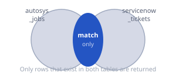
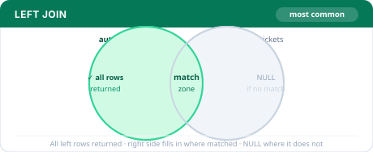
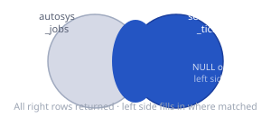
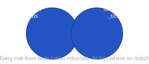

<div align="center">

&nbsp;
&nbsp;
&nbsp;


# Module 01 — SQL Fundamentals

**The language every data system speaks.**
Learn to ask questions, filter answers, summarise data, and connect tables.

</div>

---

## Contents

- [Module overview](#overview)
- [Lesson 01 — SQL Basics](#lesson-01)
  - [The data](#l01-data) · [What is a database](#l01-01) · [SELECT & FROM](#l01-02) · [WHERE](#l01-03) · [AND, OR, !=](#l01-04) · [Aggregations](#l01-05) · [HAVING](#l01-06) · [ORDER BY & LIMIT](#l01-07) · [NULL](#l01-08) · [Self-check](#l01-quiz)
- [Lesson 02 — JOINs](#lesson-02)
  - [The tools](#l02-tools) · [The scenario](#l02-scenario) · [Why JOINs](#l02-01) · [Keys](#l02-02) · [INNER JOIN](#l02-03) · [LEFT JOIN](#l02-04) · [RIGHT JOIN](#l02-05) · [FULL OUTER JOIN](#l02-06) · [NULL pattern](#l02-07) · [Self-check](#l02-quiz)
- [Quick reference](#quick-reference)

---

<a id="overview"></a>

## Module overview

<details>
<summary><strong>Lesson progress & files</strong></summary>
<br>

| # | Lesson | Status | SQL file |
|---|--------|--------|----------|
| 01 | SQL Basics | ✅ Complete | [`lesson-01-basics.sql`](lesson-01-basics.sql) |
| 02 | JOINs | ✅ Complete | [`lesson-02-joins.sql`](lesson-02-joins.sql) |
| 03 | Subqueries & CASE statements | ⬜ Upcoming | — |
| 04 | Window functions & CTEs | ⬜ Upcoming | — |

**Practice files**

| File | What it covers |
|------|---------------|
| [`practice-les-02-joins.sql`](practice-les-02-joins.sql) | Cold JOIN exercises — no hints, Copilot off |

</details>

---

<a id="lesson-01"></a>

## Lesson 01 — SQL Basics

<div align="center">

&nbsp;
&nbsp;


</div>

<br>

<a id="l01-data"></a>
<details>
<summary><strong>📋 The data — tickets table</strong></summary>
<br>

A single table: a support ticket system. One row = one ticket.

| ticket_id | type | priority | status | assigned_to | resolution_hours |
|-----------|------|----------|--------|-------------|-----------------|
| INC001 | Incident | High | Open | Nabiya | `NULL` |
| INC002 | Incident | Low | Closed | Dev Team | 4 |
| REQ001 | Request | Medium | Open | Nabiya | `NULL` |
| INC003 | Incident | High | Closed | Dev Team | 12 |
| REQ002 | Request | Low | Open | Nabiya | `NULL` |
| INC004 | Incident | Medium | Open | Dev Team | `NULL` |
| REQ003 | Request | High | Closed | Nabiya | 6 |

> 💡 `NULL` in `resolution_hours` means the ticket is still open — no resolution time exists yet. `NULL` is not zero. It means **no value exists at all**.

</details>

---

<a id="l01-01"></a>
<details>
<summary><strong>01 &nbsp;·&nbsp; What is a database?</strong></summary>
<br>

Forget the technical definition. You already understand this from real life.

Think of a database like a filing cabinet. Each drawer is a **table**. Each sheet of paper inside is a **row** — one record about one thing. Each column on that sheet is one fact about that thing.

The table above is a database table. Every row is one ticket. Every column is one fact about it.

**SQL is the language you use to ask questions about what's inside the filing cabinet.** You do not open every drawer yourself. You write a question in SQL and the database finds the answer.

<br>

- [ ] &nbsp;Got it

</details>

<a id="l01-02"></a>
<details>
<summary><strong>02 &nbsp;·&nbsp; SELECT & FROM — choosing what to show</strong></summary>
<br>

> 💬 **Plain English:** "Show me *these columns* from *this table*."

```sql
-- Show everything in the table
SELECT *
FROM tickets;

-- Show only specific columns
SELECT ticket_id, priority, status
FROM tickets;
```

`SELECT *` means *"give me all columns."* Use it when exploring. In real work, always name the specific columns — pulling unnecessary data is wasteful at scale.

<br>

- [ ] &nbsp;Got it

</details>

<a id="l01-03"></a>
<details>
<summary><strong>03 &nbsp;·&nbsp; WHERE — filtering rows</strong></summary>
<br>

> 💬 **Plain English:** "Only show me rows where *this condition* is true."

```sql
-- Only open tickets
SELECT *
FROM tickets
WHERE status = 'Open';

-- Only tickets assigned to Nabiya
SELECT *
FROM tickets
WHERE assigned_to = 'Nabiya';
```

**Why does `'Open'` have quotes but `status` does not?**

`status` is the **column name** — part of the table structure. `'Open'` is a **value** — actual data inside a cell. SQL needs quotes around values so it knows you're searching for that exact text, not looking for another column called `Open`. Structure vs value — this distinction appears in every query you will ever write.

<br>

- [ ] &nbsp;Got it

</details>

<a id="l01-04"></a>
<details>
<summary><strong>04 &nbsp;·&nbsp; AND, OR, != — combining conditions</strong></summary>
<br>

> 💬 **Plain English:** `AND` = both conditions must be true. `OR` = at least one must be true. `!=` = not equal to.

```sql
-- High priority AND still open
SELECT *
FROM tickets
WHERE priority = 'High'
AND status = 'Open';

-- Assigned to Nabiya OR Dev Team
SELECT *
FROM tickets
WHERE assigned_to = 'Nabiya'
OR assigned_to = 'Dev Team';

-- Everything except closed tickets
SELECT *
FROM tickets
WHERE status != 'Closed';
```

> ⚠️ `WHERE status != 'Closed'` and `WHERE status = 'Open'` return the same rows here — because status only has two values. Add a third value like `'Pending'` and they behave differently. Always check what values actually exist in a column before assuming equivalence.

<br>

- [ ] &nbsp;Got it

</details>

<a id="l01-05"></a>
<details>
<summary><strong>05 &nbsp;·&nbsp; COUNT, AVG, GROUP BY — summarising data</strong></summary>
<br>

> 💬 **Plain English:** Instead of showing individual rows, calculate *something about* the rows — how many, what average, what total.

```sql
-- How many tickets exist in total?
SELECT COUNT(*)
FROM tickets;

-- How many tickets per status?
SELECT status, COUNT(*)
FROM tickets
GROUP BY status;

-- How many open tickets per priority?
SELECT priority, COUNT(*)
FROM tickets
WHERE status = 'Open'
GROUP BY priority;

-- Average resolution time for closed tickets
SELECT AVG(resolution_hours)
FROM tickets
WHERE status = 'Closed';
```

**Execution order:** `WHERE` runs first and filters rows. `GROUP BY` then buckets the surviving rows. This means `WHERE` cannot filter on a grouped result — that is what `HAVING` is for.

<br>

- [ ] &nbsp;Got it

</details>

<a id="l01-06"></a>
<details>
<summary><strong>06 &nbsp;·&nbsp; HAVING — filtering after grouping</strong></summary>
<br>

> 💬 **Plain English:** "`WHERE` filters rows before grouping. `HAVING` filters groups after grouping."

```sql
-- Priority groups where average resolution time is over 5 hours
SELECT priority, AVG(resolution_hours)
FROM tickets
WHERE status = 'Closed'
GROUP BY priority
HAVING AVG(resolution_hours) > 5;
```

**The pipeline:** `WHERE` → `GROUP BY` → `HAVING`

Filter the rows, bucket them into groups, then filter the groups.

<br>

- [ ] &nbsp;Got it

</details>

<a id="l01-07"></a>
<details>
<summary><strong>07 &nbsp;·&nbsp; ORDER BY & LIMIT — sorting and capping</strong></summary>
<br>

> 💬 **Plain English:** `ORDER BY` sorts your results. `LIMIT` caps how many rows come back.

```sql
-- All tickets sorted by resolution time, longest first
SELECT ticket_id, priority, resolution_hours
FROM tickets
ORDER BY resolution_hours DESC;

-- Top 2 fastest resolved closed tickets
SELECT ticket_id, priority, resolution_hours
FROM tickets
WHERE status = 'Closed'
ORDER BY resolution_hours ASC
LIMIT 2;
```

`ASC` = smallest to largest. `DESC` = largest to smallest.

> ⚠️ **The text-sort trap:** Sorting `priority` alphabetically gives `High → Low → Medium` — not a meaningful urgency order. Add `'Critical'` and it sorts before `High` because `C` comes before `H`. Your query silently returns wrong results with no error. Fix this with `CASE` — covered in Lesson 03.

<br>

- [ ] &nbsp;Got it

</details>

<a id="l01-08"></a>
<details>
<summary><strong>08 &nbsp;·&nbsp; NULL — the missing value</strong></summary>
<br>

> 💬 **Plain English:** `NULL` means "this value does not exist." Not zero. Not empty. The complete absence of a value.

```sql
-- Find tickets with no resolution time recorded
SELECT ticket_id, status, resolution_hours
FROM tickets
WHERE resolution_hours IS NULL;
```

**Never write `WHERE resolution_hours = NULL`.** That always returns zero rows. `NULL` cannot be compared with `=` — it has no value to compare. Always use `IS NULL` or `IS NOT NULL`.

**`COUNT(*)` vs `COUNT(column)`:** `COUNT(*)` counts all rows including NULLs. `COUNT(resolution_hours)` counts only non-NULL values. Use `COUNT(column)` when NULLs should count as zero.

<br>

- [ ] &nbsp;Got it

</details>

---

<a id="l01-quiz"></a>
<details>
<summary><strong>🧠 Lesson 01 — Self-check</strong></summary>
<br>

<details>
<summary>Q1 &nbsp;·&nbsp; What is the difference between WHERE and HAVING?</summary>
<br>

`WHERE` filters individual rows **before** they are grouped. `HAVING` filters groups **after** `GROUP BY` has run. You cannot use `WHERE` to filter on an aggregated value like `COUNT(*)` or `AVG()`.

</details>

<details>
<summary>Q2 &nbsp;·&nbsp; Why does <code>WHERE resolution_hours = NULL</code> return zero rows?</summary>
<br>

`NULL` means no value exists — and nothing can be equal to the absence of a value. You must use `IS NULL` or `IS NOT NULL` to check for missing values.

</details>

<details>
<summary>Q3 &nbsp;·&nbsp; You want to count how many tickets each person is assigned. Write it in words.</summary>
<br>

`SELECT assigned_to, COUNT(*) FROM tickets GROUP BY assigned_to` — select the person's name and a count of rows, grouped by name so the count applies per person.

</details>

<details>
<summary>Q4 &nbsp;·&nbsp; What is wrong with sorting priority alphabetically?</summary>
<br>

Alphabetical order gives `High → Low → Medium` — not a meaningful urgency ranking. Adding a `'Critical'` level breaks it further: `C` sorts before `H`, so the query silently returns the wrong "highest priority" row. Text categories that represent order should never be sorted alphabetically.

</details>

</details>

---

<a id="lesson-02"></a>

## Lesson 02 — JOINs

<div align="center">

&nbsp;
&nbsp;


</div>

<br>

<a id="l02-tools"></a>
<details>
<summary><strong>🔧 The tools — what these tables represent</strong></summary>
<br>

<table>
<tr>
<td width="50%" valign="top">

**⏰ `autosys_jobs` — The Robot Alarm Clock**

At Meridian Systems, hundreds of tasks run automatically every night — sorting numbers, moving files, generating reports. Autosys schedules and runs these tasks. It records whether each task finished properly or failed.

Our `autosys_jobs` table is that task list.

</td>
<td width="50%" valign="top">

**🎫 `servicenow_tickets` — The Help-Desk Notebook**

When something breaks, the support team creates a ticket: *"this thing broke, here is how urgent it is, someone is working on it."*

Think of a sticky-note board at a repair shop — every problem gets a note, every note tracks who is fixing it.

Our `servicenow_tickets` table is that board.

</td>
</tr>
</table>

</details>

<a id="l02-scenario"></a>
<details>
<summary><strong>📋 The scenario — two tables, one connection</strong></summary>
<br>

Both tables were built by different teams but share one column: **`job_id`**.

> 🔑 Think of `job_id` like a student ID number. If both the attendance sheet and the report card use the same ID, a teacher can look up any student across both sheets — even though they were made separately. That shared ID is the **key** that connects the two tables.

### ⏰ `autosys_jobs`

| job_id | job_name | status |
|--------|----------|--------|
| `JOB001` | Daily_Sales_ETL | ❌ Failed |
| `JOB002` | Weekly_Report | ✅ Success |
| `JOB003` | Monthly_Backup | ⏳ Running |
| `JOB004` | Data_Cleanup | ❌ Failed |
| `JOB005` | User_Tracking | ✅ Success |

### 🎫 `servicenow_tickets`

| ticket_id | job_id | priority | assigned_to |
|-----------|--------|----------|-------------|
| INC001 | `JOB001` | 🔴 High | Nabiya |
| INC002 | `JOB004` | 🔴 High | Nabiya |
| INC003 | `JOB001` | 🟡 Medium | Dev Team |
| INC004 | `JOB003` | 🟢 Low | Nabiya |
| INC005 | `JOB002` | 🟢 Low | Dev Team |

> 👀 **Two things to notice before writing a single JOIN:**
> - **JOB001 appears twice** in tickets (INC001 + INC003) — one job, two tickets raised for it
> - **JOB005 has no ticket** — it ran successfully, nobody complained
>
> These two facts drive every JOIN result below.

</details>

---

<a id="l02-01"></a>
<details>
<summary><strong>01 &nbsp;·&nbsp; Why JOINs exist</strong></summary>
<br>

Imagine both tables as physical notebooks on your desk. To answer *"which tickets belong to which failed job?"* you'd flip between notebooks, match up job IDs by hand, and write the combined information yourself. Painful with 5 rows. Impossible with 5 million.

A JOIN is SQL's way of doing that combination automatically. You tell it: *"look at these two tables, find rows where `job_id` matches, and stitch those rows into one result."*

The four JOIN types differ in only one thing: **what happens when a match doesn't exist on one side?**

<br>

- [ ] &nbsp;Got it

</details>

<a id="l02-02"></a>
<details>
<summary><strong>02 &nbsp;·&nbsp; Primary key vs foreign key</strong></summary>
<br>

| Term | What it means |
|------|--------------|
| **Primary key** | The unique ID that belongs to a table. In `autosys_jobs`, that is `job_id` — every job has exactly one, none share it. Like a passport number. |
| **Foreign key** | That same ID appearing in a second table as a reference. In `servicenow_tickets`, `job_id` points back to `autosys_jobs`. It is the bridge. |
| **ON condition** | `ON aj.job_id = sn.job_id` — SQL finds rows where these values match and merges them into one output row. |

The `autosys_jobs` table *owns* `job_id`. Every table that references a job borrows that ID. The JOIN reunites them.

<br>

- [ ] &nbsp;Got it

</details>

<a id="l02-03"></a>
<details>
<summary><strong>03 &nbsp;·&nbsp; INNER JOIN</strong></summary>
<br>

> 💬 **Plain English:** "Only show me rows that exist in **both** tables at the same time."



```sql
SELECT aj.job_id, aj.job_name, aj.status,
       sn.ticket_id, sn.priority
FROM autosys_jobs AS aj
INNER JOIN servicenow_tickets AS sn
    ON aj.job_id = sn.job_id;
```

| Result | Why |
|--------|-----|
| JOB005 disappears | No matching ticket — INNER JOIN drops it |
| JOB001 appears twice | Matched two tickets (INC001 and INC003) |
| **5 rows total** | |

<br>

- [ ] &nbsp;Got it

</details>

<a id="l02-04"></a>
<details>
<summary><strong>04 &nbsp;·&nbsp; LEFT JOIN &nbsp; — &nbsp; most used</strong></summary>
<br>

> 💬 **Plain English:** "Show me every row from the left table. Add ticket info where it exists. Write `NULL` where it doesn't."



```sql
SELECT aj.job_id, aj.job_name, aj.status,
       sn.ticket_id, sn.priority
FROM autosys_jobs AS aj
LEFT JOIN servicenow_tickets AS sn
    ON aj.job_id = sn.job_id;
```

| Result | Why |
|--------|-----|
| JOB005 stays | Appears with `NULL` in ticket columns |
| JOB001 still appears twice | Still matched two tickets |
| **6 rows total** | |

> ✅ When in doubt, start with LEFT JOIN. It is the most commonly written JOIN in real analytics work.

<br>

- [ ] &nbsp;Got it

</details>

<a id="l02-05"></a>
<details>
<summary><strong>05 &nbsp;·&nbsp; RIGHT JOIN &nbsp; — &nbsp; rarely written</strong></summary>
<br>

> 💬 **Plain English:** "Show me every row from the right table. Add job info where it exists. Write `NULL` where it doesn't."



Every RIGHT JOIN can be rewritten as a LEFT JOIN by swapping which table comes first. Most analysts always write LEFT JOIN and flip the table order instead. Know it exists — you will almost never write it.

<br>

- [ ] &nbsp;Got it

</details>

<a id="l02-06"></a>
<details>
<summary><strong>06 &nbsp;·&nbsp; FULL OUTER JOIN</strong></summary>
<br>

> 💬 **Plain English:** "Show me absolutely everything from both tables. Fill in `NULL` wherever there is no match on either side."



```sql
SELECT aj.job_id, aj.job_name, aj.status,
       sn.ticket_id, sn.priority
FROM autosys_jobs AS aj
FULL OUTER JOIN servicenow_tickets AS sn
    ON aj.job_id = sn.job_id;
```

| Result | Why |
|--------|-----|
| JOB005 appears | With `NULL` on the ticket side |
| All 5 tickets appear | All have matching jobs |
| JOB001 still appears twice | One-to-many relationship |
| **6 rows total** | |

<br>

- [ ] &nbsp;Got it

</details>

<a id="l02-07"></a>
<details>
<summary><strong>07 &nbsp;·&nbsp; The NULL pattern — finding what's missing</strong></summary>
<br>

> 🎯 **Pattern:** `LEFT JOIN` + `WHERE right_key IS NULL` = find rows in the left table with nothing matching on the right

Think of a teacher with an attendance sheet and a homework pile. LEFT JOIN combines them. `WHERE submission IS NULL` finds exactly which students did not hand anything in.

```sql
-- Which jobs ran with no ticket ever raised?
SELECT aj.job_id, aj.job_name, aj.status
FROM autosys_jobs AS aj
LEFT JOIN servicenow_tickets AS sn
    ON aj.job_id = sn.job_id
WHERE sn.ticket_id IS NULL;
```

Returns only **JOB005**. The LEFT JOIN kept it with `NULL`s. The `WHERE` isolates only those unmatched rows.

**You will use this constantly:**
customers who never ordered · employees with no review · students who did not submit · failed jobs with no ticket raised

The pattern is always identical — LEFT JOIN, then `WHERE right_key IS NULL`.

<br>

- [ ] &nbsp;Got it

</details>

---

<a id="l02-quiz"></a>
<details>
<summary><strong>🧠 Lesson 02 — Self-check</strong></summary>
<br>

<details>
<summary>Q1 &nbsp;·&nbsp; You want every job including those with no ticket. Which JOIN?</summary>
<br>

**LEFT JOIN.** The left table is guaranteed to appear fully. Jobs with no matching ticket show `NULL` in the ticket columns instead of being dropped.

</details>

<details>
<summary>Q2 &nbsp;·&nbsp; INNER JOIN returns 5 rows. LEFT JOIN on the same tables returns 7. What do the extra 2 rows mean?</summary>
<br>

There are **2 rows in the left table with no match in the right.** INNER JOIN dropped them silently. LEFT JOIN kept them and filled the right-side columns with `NULL`.

</details>

<details>
<summary>Q3 &nbsp;·&nbsp; Why does JOB001 appear twice even though it only exists once in autosys_jobs?</summary>
<br>

JOB001 matched **two rows** in `servicenow_tickets` — INC001 and INC003. A JOIN creates one output row per match. One job × two tickets = two output rows. This is called a **one-to-many relationship**.

</details>

<details>
<summary>Q4 &nbsp;·&nbsp; Describe the pattern for finding jobs that never had a ticket raised.</summary>
<br>

`LEFT JOIN servicenow_tickets ON job_id`, then `WHERE sn.ticket_id IS NULL`. The LEFT JOIN keeps all jobs including those with no ticket. `IS NULL` isolates only the unmatched ones.

</details>

<details>
<summary>Q5 &nbsp;·&nbsp; You have a RIGHT JOIN. How do you rewrite it as a LEFT JOIN?</summary>
<br>

Swap the table positions — move the right table into `FROM`, move the left table into `JOIN`, change `RIGHT JOIN` to `LEFT JOIN`. The result is identical. This is why most analysts always write LEFT JOIN.

</details>

</details>

---

<a id="quick-reference"></a>

## Quick reference

<details>
<summary><strong>Core SQL clauses — execution order</strong></summary>
<br>

| Clause | What it does | Runs |
|--------|-------------|------|
| `FROM` | Specify the table | 1st |
| `WHERE` | Filter rows before grouping | 2nd |
| `GROUP BY` | Bucket rows into groups | 3rd |
| `HAVING` | Filter groups after grouping | 4th |
| `SELECT` | Choose which columns to show | 5th |
| `ORDER BY` | Sort the final result | 6th |
| `LIMIT` | Cap the number of rows returned | Last |

</details>

<details>
<summary><strong>JOIN types at a glance</strong></summary>
<br>

| | Type | What it returns | NULLs on |
|---|---|---|---|
| 🔵 | `INNER JOIN` | Only rows matching in both tables | Neither |
| 🟢 | `LEFT JOIN` | All left rows + matching right rows | Right side |
| 🟡 | `RIGHT JOIN` | All right rows + matching left rows | Left side |
| 🟣 | `FULL OUTER JOIN` | Every row from both tables | Either side |

</details>

<details>
<summary><strong>Common traps</strong></summary>
<br>

| Trap | Why it happens | Fix |
|------|---------------|-----|
| `WHERE x = NULL` returns nothing | `NULL` cannot be compared with `=` | Use `IS NULL` |
| Alphabetical sort breaks priority order | `High → Low → Medium` is not urgency | Use `CASE` to assign numbers |
| JOIN returns more rows than expected | One-to-many relationships duplicate rows | Check for duplicate keys first |
| `COUNT(*)` counts NULLs | `COUNT(*)` counts rows, not values | Use `COUNT(column)` to ignore NULLs |

</details>

---

<div align="center">

*analytics-engineer-journey &nbsp;·&nbsp; module-01-sql*
&nbsp;&nbsp;
[github.com/nabiya15](https://github.com/nabiya15)

</div>
